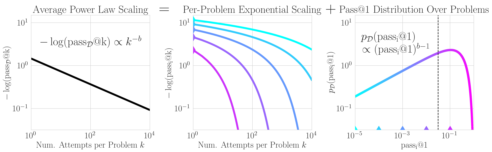

# How Do Large Language Monkeys Get Their Power (Laws)?



## Installation

1. (Optional) Update conda:

`conda update -n base -c defaults conda -y`

2. Create and activate the conda environment:

`conda create -n origin_of_scaling_env python=3.11 -y && conda activate origin_of_scaling_env`

3. Install the required packages:

`conda install -c conda-forge numpy pandas scipy matplotlib seaborn pyarrow fsspec datasets huggingface_hub -y`

4. If generating the Many-Shot In-Context Learning data:

`conda install pytorch-gpu torchvision torchaudio pytorch-cuda=12.4 -c pytorch -c nvidia -y`

`pip install protobuf sentencepiece`

## Citing

To cite this work, please use:

```
@inproceedings{schaeffer2025monkeypowerlaws,
    title={How Do Large Language Monkeys Get Their Power (Laws)?},
    author={Rylan Schaeffer and Joshua Kazdan and John Hughes and Jordan Juravsky and Sara Price and Aengus Lynch and Erik Jones and Robert Kirk and Azalia Mirhoseini and Sanmi Koyejo},
    booktitle={Forty-second International Conference on Machine Learning},
    year={2025},
    url={https://openreview.net/forum?id=QqVZ28qems}
}
```

## Contact

Questions? Comments? Interested in collaborating? Open an issue or email rschaef@cs.stanford.edu and sanmi@cs.stanford.edu.
